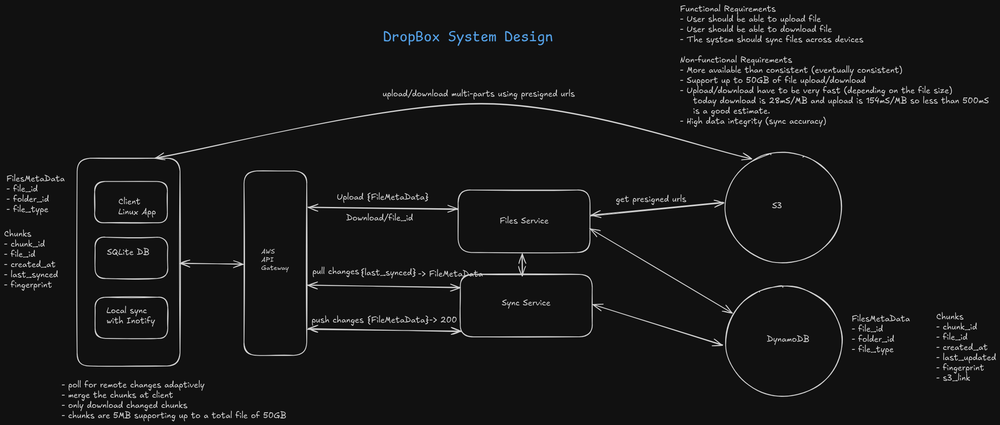

# Dropbox System Design

This repository contains the source code and design documents for a Dropbox-like file synchronization system. The system is designed to efficiently synchronize files across multiple devices with support for large files.



## Features

- Real-time file synchronization using inotify
- File chunking for efficient transfer of large files
- Deduplication using content-based hashing
- Hierarchical folder structure support
- RESTful API for file and folder management
- AWS services simulation (S3, DynamoDB, API Gateway)

## Components

- **Client**: Handles local file synchronization and provides a REST API
- **Backend Services**: Microservices for handling various aspects of the system
  - **Files Service**: Handles file metadata and multipart uploads
  - **Sync Service**: Handles file synchronization between clients and server
- **Database**: SQLite database for storing file metadata and chunk information
- **Chunking System**: Splits files into chunks for efficient storage and transfer
- **AWS Services**: Simulated AWS services for development and testing
  - **MinIO**: S3-compatible object storage
  - **DynamoDB Local**: DynamoDB-compatible NoSQL database
  - **Nginx**: API Gateway for routing and rate limiting

## Testing

The system includes a comprehensive test suite to verify functionality:

```bash
# Run all smoke tests
./client/tests/smoke/run_all_tests.sh

# Run specific tests
./client/tests/smoke/test_file_sync.sh
./client/tests/smoke/test_file_modifications.sh
./client/tests/smoke/test_folder_operations.sh
./client/tests/smoke/test_api_endpoints.sh
```

For more information about the test suite, see [client/tests/README.md](client/tests/README.md).

## Getting Started

### Client

#### Single Client (Device A)

1. Start the Docker container:
   ```bash
   ./client/scripts/bash/start_client_container.sh
   ```

2. Access the API at http://localhost:8000

3. Files placed in the `my_dropbox` directory will be automatically synchronized.

#### Multi-Client Setup (Device A and Device B)

1. Start both client containers:
   ```bash
   ./client/scripts/bash/start_multi_clients.sh
   ```

2. Access the APIs:
   - Device A: http://localhost:8000
   - Device B: http://localhost:8010

3. Files placed in either device's `my_dropbox` directory will be synchronized across both devices.

For more information about the multi-client setup, see [client/docs/multi_client_setup.md](client/docs/multi_client_setup.md).

### AWS Services

1. Start the AWS services:
   ```bash
   ./deployment/aws/deployment_scripts/start_aws_services.sh
   ```

2. Access the services:
   - API Gateway: http://localhost:8080/
   - MinIO Console: http://localhost:8080/minio-console/ (login: minioadmin/minioadmin)
   - S3 API: http://localhost:8080/s3/
   - DynamoDB API: http://localhost:8080/dynamodb/

3. Stop the services:
   ```bash
   ./deployment/aws/deployment_scripts/stop_aws_services.sh
   ```

For more information about the AWS services, see [deployment/aws/README.md](deployment/aws/README.md).

### Backend Services

1. Start the AWS services first (required for backend services):
   ```bash
   ./deployment/aws/deployment_scripts/start_aws_services.sh
   ```

2. Start the backend services:
   ```bash
   ./deployment/backend/deployment_scripts/start_backend_services.sh
   ```

3. Access the services:
   - Files Service API: http://localhost:8001/
   - Sync Service API: http://localhost:8003/

4. Stop the services:
   ```bash
   ./deployment/backend/deployment_scripts/stop_backend_services.sh
   ```

For more information about the backend services, see [deployment/backend/README.md](deployment/backend/README.md).

## Acknowledgements

Many thanks to [Hello Interview](https://www.hellointerview.com/learn/system-design/problem-breakdowns/dropbox) for the original design.
